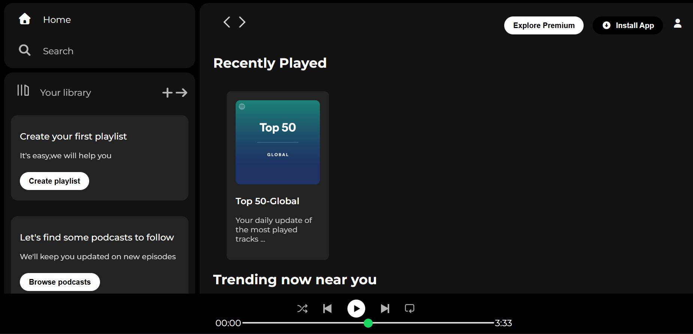
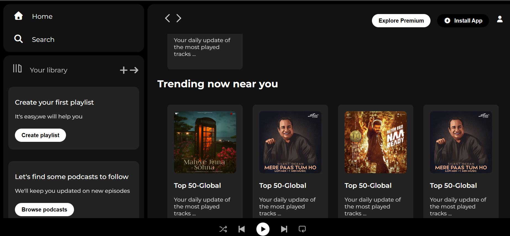
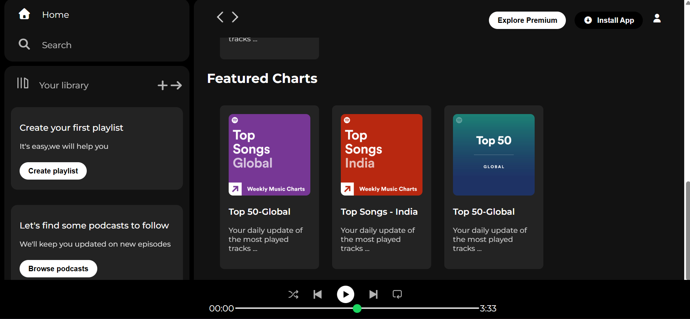

# 🎧 Spotify Web Player Clone

This is a responsive front-end clone inspired by **Spotify’s Web Player** UI.  
It is built using **HTML, CSS**, and **Font Awesome**, featuring a modern music interface, sidebar navigation, playlist cards, and a sticky music controller at the bottom.

---
## 📸 Project Preview

### 🖼 Screenshots
Here’s how the project looks 👇





---
## 🌐 Live Demo
Check it out here: https://github.com/Digvej/spotify-web-player-clone

---

## 🚀 Features

- ✅ Sidebar navigation (Home, Search, Library)
- ✅ "Create your first playlist" helper
- ✅ Trending songs & featured charts
- ✅ Recently played section
- ✅ Responsive card layout
- ✅ Sticky top navigation (Install App / Profile)
- ✅ Functional-looking music player UI (seek bar, controls)
- ✅ Clean Spotify-style theme

---

## 🛠️ Tech Stack

| Technology | Purpose |
|-----------|----------|
| HTML5 | Structure |
| CSS3 | Styling & Layout |
| Font Awesome | Icons |
| Google Fonts (Montserrat) | Typography |

---

## 📂 Folder Structure

Spotify-web-player-clone
│
├── assets/
│ ├── backward_icon.png
│ ├── forward_icon.png
│ ├── library_icon.png
│ ├── logo.png
│ ├── play_musicbar.png
│ ├── player_icon1.png – player_icon5.png
│ ├── card1img.jpeg – card6img.jpeg
│
├── index.html
├── style.css
└── README.md

---

## 🛠️ How to Run

1. Clone this repository:
   ```bash
   git clone https://github.com/Digvej/spotify-web-player-clone.git
